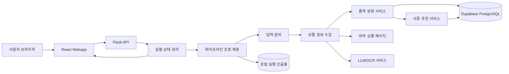

# 현재 아키텍처

기준 커밋: `b9d706fa5a2794ba8d7be2e6aa761aa7a427a91b`

현재 애플리케이션은 Flask와 React를 한 저장소에서 운영하는 모듈형 모놀리식 구조다.

## 전체 구성



## 실행 단위

```text
python asap_app.py
        │
        ├─ Flask API 실행
        ├─ webapp/dist 정적 파일 제공
        ├─ 실행 요청을 백그라운드 스레드에 전달
        ├─ 진행 상태를 메모리에 보관
        └─ 실행 결과를 artifacts에 저장
```

기본 포트:

- 통합 Web/API: `8060`
- Vite 개발 서버: `5173`

## 요청 처리 흐름

1. 브라우저가 Flask API에 작업을 등록한다.
2. API가 작업 ID를 발급한다.
3. 백그라운드 스레드가 파이프라인을 실행한다.
4. Web 화면은 SSE와 조회 API로 진행 상태를 받는다.
5. 파이프라인은 PostgreSQL과 외부 서비스에서 필요한 데이터를 읽는다.
6. 결과는 작업별 산출물 디렉터리에 저장된다.
7. Flask가 최종 결과를 Web 화면에 반환한다.

## 모듈 책임

| 경로 | 책임 |
| --- | --- |
| `asap_app.py` | 설정 로드, Flask 실행, React 빌드 제공 |
| `src/backend/` | HTTP API, SSE, 작업 상태, UI 응답 변환 |
| `src/bussiness_logic/pipeline/` | 실행 순서와 공통 실행 컨텍스트 관리 |
| `src/bussiness_logic/input_process/` | 사용자 입력 정규화 |
| `src/bussiness_logic/product/` | 상품 페이지 수집, OCR, 상품 정보 구성 |
| `src/bussiness_logic/classification/` | DB 조회와 품목 후보 결과 구성 |
| `src/bussiness_logic/document/` | 선택 코드 기반 서류 패키지 구성 |
| `src/bussiness_logic/bridge/` | 외부 LLM 런타임 연결 |
| `src/db/` | SQLAlchemy 세션과 연결 풀 관리 |
| `webapp/` | React 화면과 API 클라이언트 |
| `DB/` | 오프라인 적재·마이그레이션 도구 |
| `artifacts/` | 실행 결과와 기업 화면 임시 저장소 |

## 저장 구조

파이프라인 결과:

```text
artifacts/outputs/<product-id>/<job-id>/
├── blackboard.json
├── component_runs.jsonl
└── api_snapshot.json
```

기업 화면의 현재 임시 저장 구조:

```text
artifacts/enterprise/
├── events.jsonl
├── cases/
└── uploads/
```

`artifacts/enterprise`는 파일 기반 구현이다. 다중 서버 운영 전에는 DB 또는 공용 저장소로 전환해야 한다.

## 데이터베이스 연결

백엔드는 PostgreSQL 연결 문자열을 사용한다.

```text
Flask Backend
    ├─ SQLAlchemy connection pool
    ├─ 분류 데이터 조회
    └─ 서류 데이터 조회
             │
             ▼
      Supabase PostgreSQL
```

DB 비밀값은 `.env.asap_app`에서만 읽는다. Web 브라우저에는 전달하지 않는다.

## Web 제공 방식

운영형 단일 프로세스:

```text
Browser ──HTTP/SSE──> Flask :8060 ──> webapp/dist
```

개발형 분리 프로세스:

```text
Browser ──> Vite :5173 ──/api proxy──> Flask :8060
```

## 현재 운영 제약

- Flask 내장 서버를 사용한다.
- 작업 실행은 프로세스 내부 daemon thread를 사용한다.
- 실행 상태 레지스트리는 프로세스 메모리에 있다.
- 일부 상태는 로컬 `artifacts`에 저장한다.
- 외부 작업 큐가 없다.
- 다중 인스턴스 동기화가 없다.
- 기업 화면 저장소는 로컬 파일 기반이다.

따라서 현재 구조는 단일 인스턴스 시연과 인수인계 확인에 적합하다. 수평 확장과 고가용성 운영에는 추가 작업이 필요하다.

## 운영 전환 시 우선 작업

1. Flask 내장 서버를 운영 WSGI 서버로 교체한다.
2. 작업 실행을 외부 큐와 별도 Worker로 분리한다.
3. 실행 상태와 기업 데이터를 PostgreSQL에 통합한다.
4. 업로드 파일을 공용 Object Storage로 이동한다.
5. 인증·권한·RLS 정책을 확정한다.
6. Reverse Proxy, TLS, 로그, Health Check를 구성한다.

이 문서는 현재 코드의 배치와 실행 경계만 설명한다.
