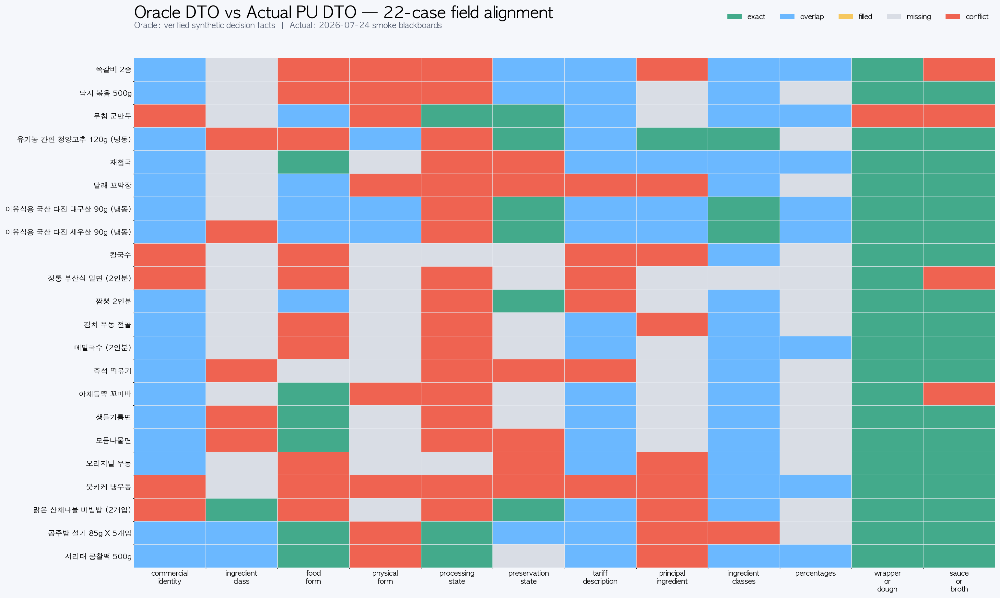
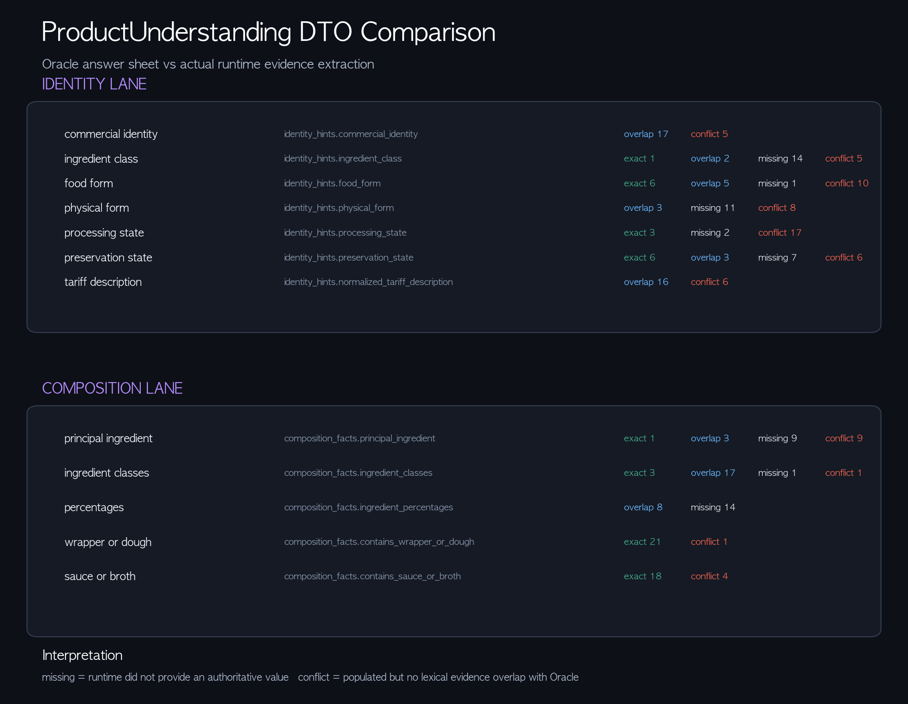

# Oracle DTO와 실제 PU DTO 비교

이 폴더는 런타임 데이터 소스가 아니라 비교 기준 자료다.

## 입력 자료

- `oracle_product_understanding_22.json`
  - 식품 스모크 22건에 대해 분류 질문에 답하도록 구성한 합성
    `ProductUnderstandingPackage`.
- `actual_pu_product_understanding_22.json`
  - 2026-07-24 실제 런타임 blackboard에서 추출한 PU DTO 22건.

각 JSON은 원본 경로와 SHA-256을 기록한다. 따라서 원래 테스트 artifact를
삭제해도 비교 기준은 유지된다.

## 비교 결과

- `oracle_vs_pu_comparison.json`: 필드별 값과 비교 상태.
- `oracle_vs_pu_overview.png`: 22개 상품의 필드 정렬 heatmap.
- `oracle_vs_pu_lane_detail.png`: Identity Lane과 Composition Lane 커버리지.

상태 의미:

- `exact`: 정규화한 값이 같다.
- `overlap`: 실제 값과 Oracle 값에 명시적인 공통 용어가 있다.
- `missing`: 실제 DTO에 권위 있는 값이 없다.
- `conflict`: 실제 필드가 채워졌지만 Oracle 값과 직접적인 어휘 중복이 없다.

`conflict`는 감사 신호이지 자동 오답 판정이 아니다. 한영 표현 차이 또는 서로
다른 유효 taxonomy 수준도 이 보수적인 비교에서는 conflict가 될 수 있다.
